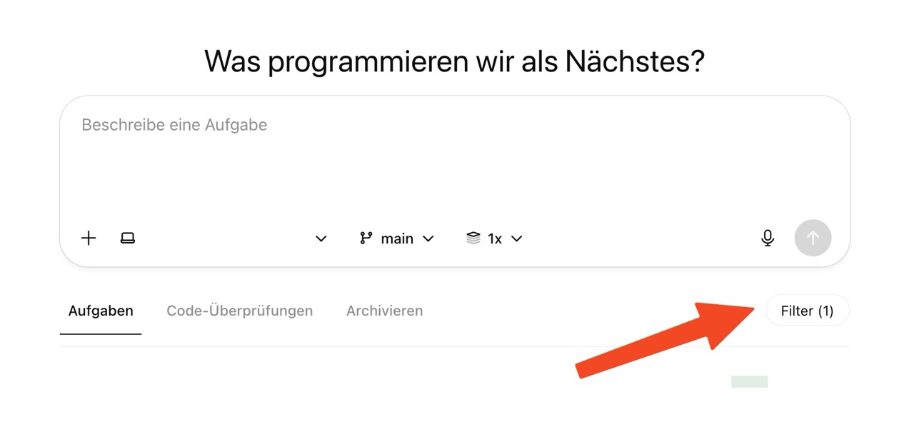

# BetterCodex Browser Extensions

BetterCodex adds a repository filter to the ChatGPT Codex task list so you can stay focused on the work that matters most. The extension is available for Firefox and Chromium-based browsers and automatically adapts its UI to English or German based on your browser language settings.



## Features

- 🔍 **Repository-aware filtering** – Quickly narrow the task list down to a single repository or show them all again with one click.
- 💾 **Persistent preferences** – Your last filter choice is remembered automatically for each Codex session.
- 🌗 **Theme-friendly design** – Looks great in both light and dark mode.
- 🌍 **Smart localization** – UI copy switches between English and German depending on your browser language.

## Installation

### Create installable packages

Run the helper script to bundle both extensions into ready-to-upload archives and (optionally) produce a signed Firefox build when your Mozilla API credentials are available in `~/.bashrc`:

```bash
./scripts/package_extensions.sh
```

The command produces `dist/chrome.zip` and `dist/firefox.xpi`. When `web-ext` is installed and your `AMO_JWT_ISSUER`/`AMO_JWT_SECRET` (or `WEB_EXT_API_KEY`/`WEB_EXT_API_SECRET`) variables are exported in `~/.bashrc`, the script also signs the Firefox add-on and stores the result in `dist/firefox-signed.xpi`. You can upload these files directly to the Chrome Web Store and the Firefox Add-ons Developer Hub for publishing or share them for manual installation. The `.xpi` extension is required for Firefox to recognise the package as an installable add-on.

### Firefox

1. Download or clone this repository and open the `firefox` folder.
2. Visit `about:debugging#/runtime/this-firefox` in Firefox.
3. Click **Load Temporary Add-on…** and select the `manifest.json` file inside the `firefox` folder.
4. Use the **Inspect** button next to the loaded add-on in the runtime list whenever you want to open the DevTools console or reload the extension after making code changes.
5. Navigate to ChatGPT Codex – the filter appears automatically within a second of the page loading.

> **Tip:** For long-term use you can package the folder and submit it for signing at [addons.mozilla.org/developers](https://addons.mozilla.org/developers).

### Chromium-based browsers (Chrome, Edge, Brave, Arc, …)

1. Download or clone this repository and open the `chrome` folder.
2. Navigate to `chrome://extensions` (or the equivalent extensions page in your browser).
3. Enable **Developer mode** (usually a toggle in the top-right corner).
4. Choose **Load unpacked** and select the `chrome` folder.
5. Open ChatGPT Codex; the repository filter will appear automatically after the page loads.

## Local development

### Firefox with live reload

Install the [`web-ext`](https://extensionworkshop.com/documentation/develop/web-ext-command-reference/) CLI once (`npm install -g web-ext`). Then run the extension in a dedicated Firefox profile that automatically reloads when files change:

```bash
web-ext run --source-dir firefox --watch-file firefox --browser-console
```

If you already have signing credentials exported in `~/.bashrc`, the same values are reused when you later run the packaging script.

### Chromium-based browsers

Chromium does not provide a built-in live reload workflow for unpacked extensions, but you can keep the Extensions page open with **Developer mode** enabled and click the **Reload** icon after each change. Tools like [Extensions Reloader](https://chromewebstore.google.com/detail/extensions-reloader/ifooldnmmcmlbdennkpdnlnbgbmfalko) can speed up the process if you prefer one-click reloads.

## Usage

1. Visit `https://chatgpt.com/codex` (or the OpenAI Codex URL available to you).
2. Use the **Repo filter** input that appears next to the Codex navigation tabs.
3. Start typing to search, or click inside the input to see all repositories and pick one from the suggestion list.
4. Clear the input using the **×** button to show tasks from every repository again.

## Project Structure

```
better-codex/
├── chrome/      # Chromium extension (Manifest V3)
├── firefox/     # Firefox extension (Manifest V2)
├── screenshot.jpeg
└── README.md
```

Each browser folder contains `manifest.json`, `content.js`, and `style.css`. The logic is shared across both extensions to keep behaviour identical.

## License

This project is provided as-is under the MIT License. Feel free to adapt it to your own Codex workflow.
